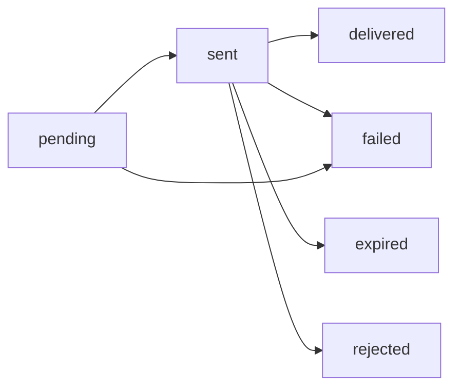

## Overview

Retrieve detailed information about a specific SMS message, including per-recipient delivery status and related metadata. This endpoint is useful for tracking message delivery and debugging issues.

## Endpoint

<CodeGroup>

```bash cURL
curl --request GET \
  "https://sms.lamah.com/api/sms/messages/a3a7b9a2-9d3f-4a7e-9b4e-13b1e9b1f2aa?message_id=a3a7b9a2-9d3f-4a7e-9b4e-13b1e9b1f2aa" \
  --header "Authorization: Bearer YOUR_API_TOKEN"
```

```javascript JavaScript
const messageId = 'a3a7b9a2-9d3f-4a7e-9b4e-13b1e9b1f2aa';
const response = await fetch(`https://sms.lamah.com/api/sms/messages/${messageId}?message_id=${messageId}`, {
  method: 'GET',
  headers: {
    'Authorization': 'Bearer YOUR_API_TOKEN',
    'Accept': 'application/json'
  }
});

const data = await response.json();
console.log(data);
```

```python Python
import requests

message_id = "a3a7b9a2-9d3f-4a7e-9b4e-13b1e9b1f2aa"
url = f"https://sms.lamah.com/api/sms/messages/{message_id}"
headers = {
    "Authorization": "Bearer YOUR_API_TOKEN",
    "Accept": "application/json"
}
params = {
    "message_id": message_id
}

response = requests.get(url, headers=headers, params=params)
print(response.json())
```

```php PHP
<?php
$messageId = 'a3a7b9a2-9d3f-4a7e-9b4e-13b1e9b1f2aa';
$url = "https://sms.lamah.com/api/sms/messages/{$messageId}?message_id={$messageId}";

$curl = curl_init();
curl_setopt_array($curl, array(
  CURLOPT_URL => $url,
  CURLOPT_RETURNTRANSFER => true,
  CURLOPT_HTTPHEADER => array(
    'Authorization: Bearer YOUR_API_TOKEN',
    'Accept: application/json'
  ),
));

$response = curl_exec($curl);
curl_close($curl);
echo $response;
?>
```

</CodeGroup>

## Path Parameters

| Parameter | Type | Required | Description |
|-----------|------|----------|-------------|
| `message_id` | string (UUID) | ✅ | The unique identifier of the message |

## Query Parameters

| Parameter | Type | Required | Description |
|-----------|------|----------|-------------|
| `message_id` | string (UUID) | ✅ | UUID of the message (same as path parameter) |

<Note>
  The message_id is required both in the URL path and as a query parameter for additional validation.
</Note>

## Response

### Success Response (200 OK)

```json
[
  {
    "short_message": "تم تأكيد موعد معاينة العقار غدًا الساعة 5 مساءً في قرقارش، طرابلس.",
    "message_type": "sms",
    "send_type": "single",
    "contact_group_id": null,
    "message_consumption": 1,
    "receiver": [
      {
        "number": "00218912345678",
        "sent_at": "2024-01-15T10:30:02Z",
        "delivered_at": "2024-01-15T10:30:15Z",
        "status": "delivered",
        "delivery_report": null,
        "created_at": "2024-01-15T10:30:00Z",
        "updated_at": "2024-01-15T10:30:15Z"
      }
    ]
  }
]
```

### Response Fields

| Field | Type | Description |
|-------|------|-------------|
| `short_message` | string | The message content |
| `message_type` | string | Always `sms` for SMS messages |
| `send_type` | string | `single` or `multiple` |
| `contact_group_id` | string | Contact group UUID if applicable |
| `message_consumption` | integer | SMS parts consumed for this message |
| `receiver` | array | List of receipt objects (one per recipient) |

### Receipt Status Values

| Status | Description |
|--------|-------------|
| `pending` | Message is queued for sending |
| `sent` | Message has been sent to the carrier |
| `delivered` | Message has been delivered to the recipient |
| `failed` | Message delivery failed |

### Receipt Fields

| Field | Type | Description |
|-------|------|-------------|
| `number` | string | Recipient phone number |
| `sent_at` | string | When the message was sent |
| `delivered_at` | string | When the message was delivered |
| `status` | string | Delivery status for this recipient |
| `delivery_report` | string | Raw delivery report if available |


## Error Responses

### 404 Not Found

```json
{ "message": "Message not found" }
```

### 401 Unauthorized

```json
{ "message": "Unauthenticated." }
```

### 403 Forbidden

```json
{ "message": "Message does not belong to your project" }
```

## Message Status Tracking

### Status Flow



### Typical Timeline

1. **pending** (0-5 seconds): Message is queued
2. **sent** (5-30 seconds): Message sent to carrier
3. **delivered** (30 seconds - 5 minutes): Message delivered to device

## Use Cases

<CardGroup cols={2}>
  <Card title="Delivery Confirmation" icon="check-circle">
    Confirm that important messages were delivered
  </Card>
  <Card title="Debugging Failed Messages" icon="bug">
    Investigate why messages failed to deliver
  </Card>
  <Card title="Audit Trail" icon="file-text">
    Maintain records of all sent messages
  </Card>
  <Card title="Cost Tracking" icon="dollar-sign">
    Track costs for individual messages
  </Card>
</CardGroup>

## Polling for Status Updates

<CodeGroup>

```javascript Status Polling
const pollMessageStatus = async (messageId, maxAttempts = 10) => {
  for (let attempt = 1; attempt <= maxAttempts; attempt++) {
    try {
      const res = await fetch(`https://sms.lamah.com/api/sms/messages/${messageId}?message_id=${messageId}`, {
        headers: { 'Authorization': 'Bearer YOUR_API_TOKEN', 'Accept': 'application/json' }
      });
      const arr = await res.json();
      const msg = Array.isArray(arr) ? arr[0] : arr;
      const receivers = msg.receiver || [];
      const statuses = receivers.map(r => r.status);
      const allDelivered = statuses.length > 0 && statuses.every(s => s === 'delivered');
      const anyFailed = statuses.some(s => s === 'failed' || s === 'rejected' || s === 'expired');

      console.log(`Attempt ${attempt}: ${JSON.stringify(statuses)}`);

      if (allDelivered || anyFailed) {
        console.log('Final state reached');
        return msg;
      }

      await new Promise(r => setTimeout(r, 5000));
    } catch (e) {
      console.error(`Polling attempt ${attempt} failed:`, e);
    }
  }
  console.log('Max polling attempts reached');
  return null;
};

// Usage
const message = await pollMessageStatus('a3a7b9a2-9d3f-4a7e-9b4e-13b1e9b1f2aa');
```

```python Status Polling
import requests
import time

def poll_message_status(message_id, max_attempts=10):
    for attempt in range(1, max_attempts + 1):
        try:
            response = requests.get(
                f'https://sms.lamah.com/api/sms/messages/{message_id}',
                headers={
                    'Authorization': 'Bearer YOUR_API_TOKEN',
                    'Accept': 'application/json'
                },
                params={'message_id': message_id}
            )
            
            arr = response.json()
            msg = arr[0] if isinstance(arr, list) else arr
            receivers = msg.get('receiver', [])
            statuses = [r.get('status') for r in receivers]
            print(f"Attempt {attempt}: {statuses}")

            all_delivered = len(statuses) > 0 and all(s == 'delivered' for s in statuses)
            any_failed = any(s in ['failed', 'rejected', 'expired'] for s in statuses)

            if all_delivered or any_failed:
                print("Final state reached")
                return msg
            
            # Wait before next poll
            time.sleep(5)
            
        except Exception as error:
            print(f"Polling attempt {attempt} failed: {error}")
    
    print("Max polling attempts reached")
    return None

# Usage
message_status = poll_message_status('a3a7b9a2-9d3f-4a7e-9b4e-13b1e9b1f2aa')
```

</CodeGroup>

## Webhook Alternative

<Tip>
  For real-time status updates, consider setting up webhooks instead of polling. Webhooks provide immediate notifications when message status changes.
</Tip>

Instead of polling, you can configure webhooks to receive automatic status updates:

```json
{
  "event": "message.delivered",
  "message_id": "msg_123456789",
  "status": "delivered",
  "delivered_at": "2024-01-15T10:30:15Z",
  "delivery_report": {
    "carrier": "Verizon",
    "country": "US"
  }
}
```

## Error Handling

<CodeGroup>

```javascript Error Handling
const getMessageDetails = async (messageId) => {
  try {
    const response = await fetch(`https://sms.lamah.com/api/sms/messages/${messageId}?message_id=${messageId}`, {
      headers: {
        'Authorization': 'Bearer YOUR_API_TOKEN',
        'Accept': 'application/json'
      }
    });

    if (!response.ok) {
      const error = await response.json();
      
      if (error.code === 'MESSAGE_NOT_FOUND') {
        console.error('Message not found:', messageId);
      } else if (error.code === 'ACCESS_DENIED') {
        console.error('Access denied for message:', messageId);
      } else {
        console.error('Failed to get message details:', error.error);
      }
      return null;
    }

    const message = await response.json();
    return message;
    
  } catch (error) {
    console.error('Network error:', error);
    return null;
  }
};
```

```python Error Handling
def get_message_details(message_id):
    try:
        response = requests.get(
            f'https://sms.lamah.com/api/sms/messages/{message_id}',
            headers={
                'Authorization': 'Bearer YOUR_API_TOKEN',
                'Accept': 'application/json'
            },
            params={'message_id': message_id}
        )
        
        if not response.ok:
            error = response.json()
            
            if error['code'] == 'MESSAGE_NOT_FOUND':
                print(f"Message not found: {message_id}")
            elif error['code'] == 'ACCESS_DENIED':
                print(f"Access denied for message: {message_id}")
            else:
                print(f"Failed to get message details: {error['error']}")
            return None
        
        message = response.json()
        return message
        
    except Exception as error:
        print(f"Network error: {error}")
        return None
```

</CodeGroup>
